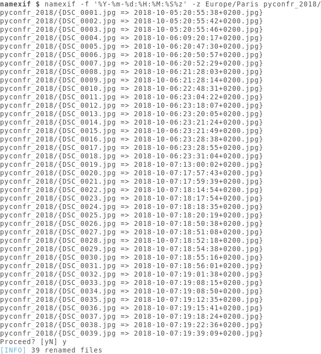

# namexif

Rename photos according to their EXIF date tag.

## Screenshot



## Installation

You may install `namexif` locally by running

```console
$ cargo install --git https://github.com/vivienm/namexif.git
```
