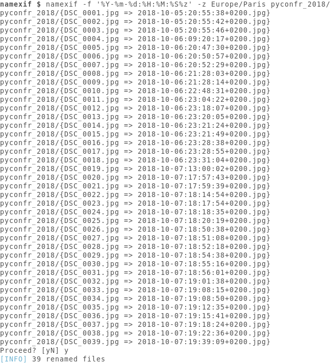

# namexif

Rename photos according to their EXIF date tag.

Dates come from `DateTimeOriginal`, including `OffsetTimeOriginal` and
`SubSecTimeOriginal` when present. `--timezone` (or `NAMEXIF_TIMEZONE`) selects
the time zone used in filenames, defaulting to the system time zone. Dates
without an EXIF offset, or with a blank offset, are interpreted in that zone.
If such a date falls in a skipped or repeated hour during a clock change, the
photo is left unchanged and an error is reported. An explicit EXIF offset
determines the instant even during these transitions.

Use `--format '%Y%m%dT%H%M%S%.f%z'` to include fractional seconds and distinguish
photos taken within the same second. If multiple photos still produce the same
filename, the batch is rejected before renaming any files. `--dry-run` previews
the proposed names.

## Screenshot



## Installation

You may install `namexif` locally by running

```console
$ cargo install --git https://github.com/vivienm/namexif.git
```
